# UserCacheVal整体流程图

## 一、CacheClient 相关流程图

### 1. CacheClient 功能总览

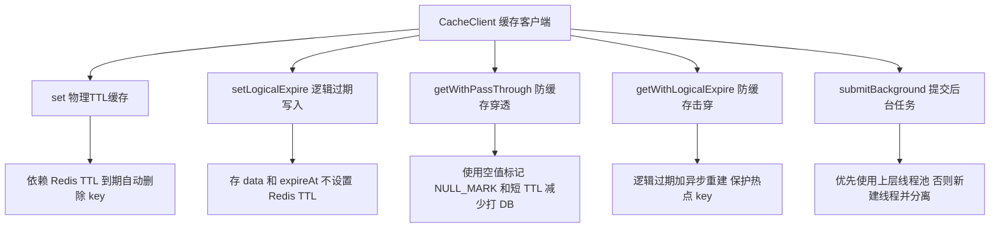

------

### 2. set 物理 TTL 写入流程

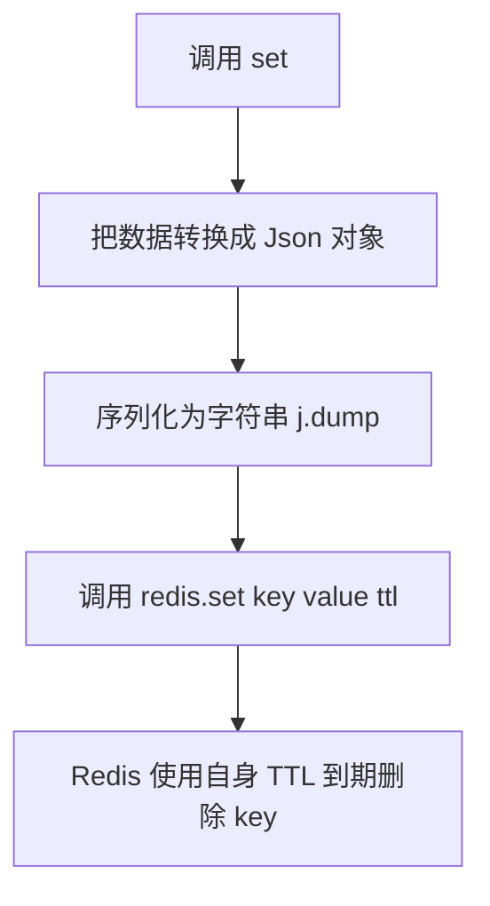

------

### 3. setLogicalExpire 逻辑过期写入流程

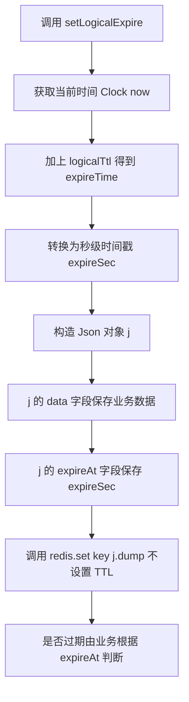

------

### 4. getWithPassThrough 防缓存穿透

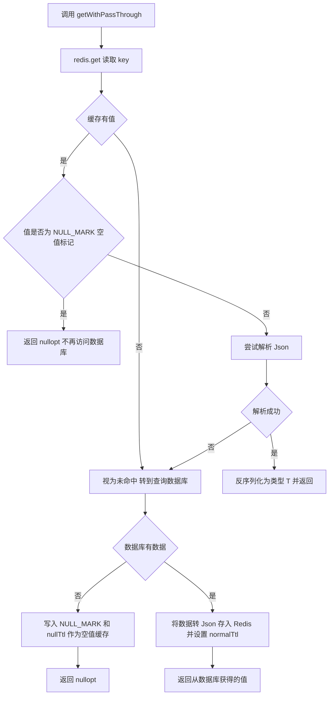

------

### 5. getWithLogicalExpire 防缓存击穿

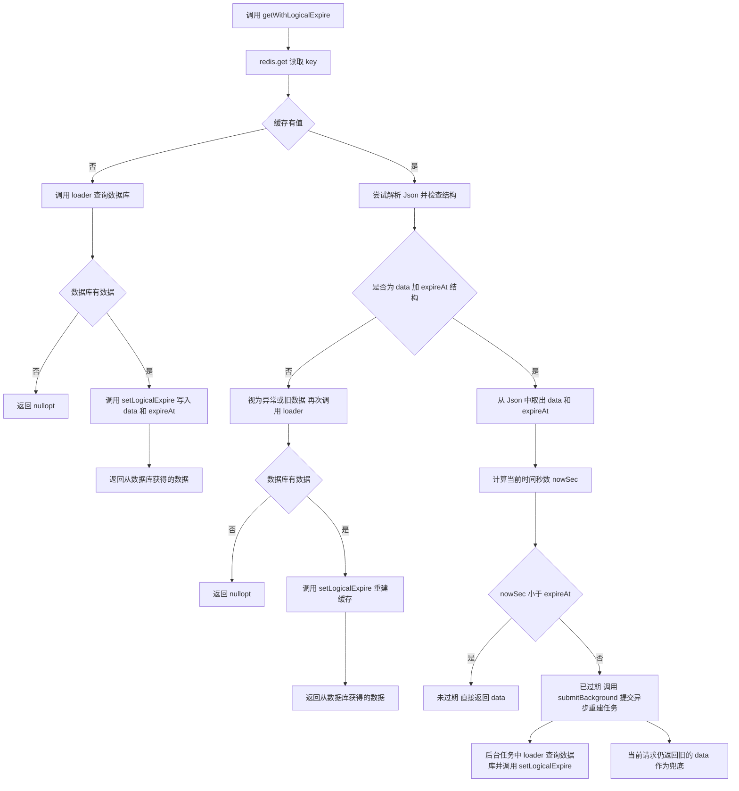

------

### 6. submitBackground 后台任务提交

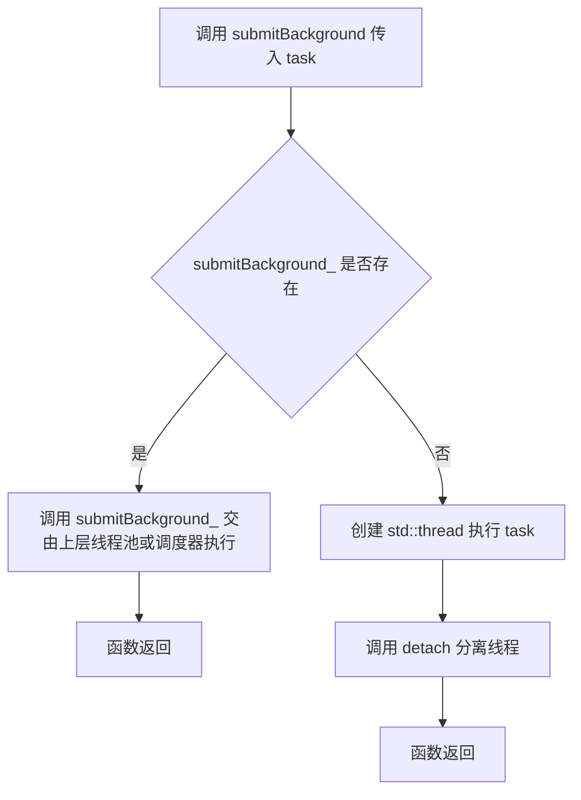

------

## 二、RedisClient 相关流程图

### 1. RedisClient 接口总览

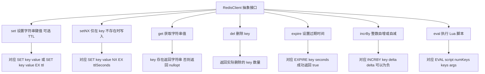

------

### 2. set 调用流程

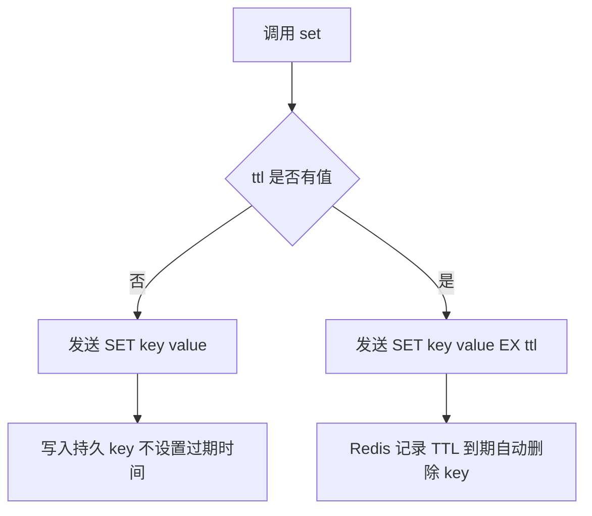

------

### 3. setNX 调用语义

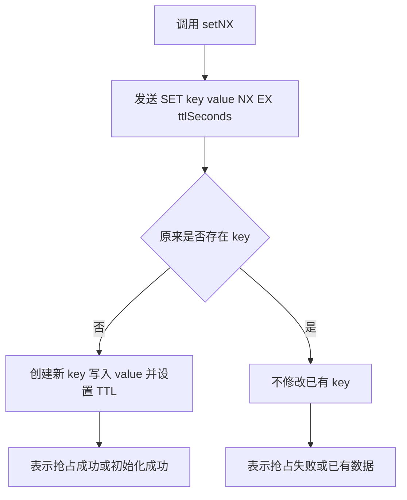

------

### 4. get del expire incrBy eval 简略流程

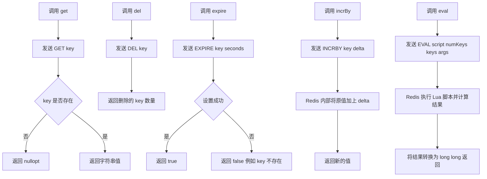

------

## 三、LocalUserByName 本地用户名缓存

### 1. 结构总览

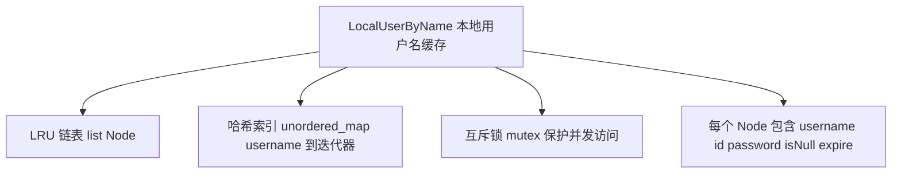

------

### 2. get 按用户名读取

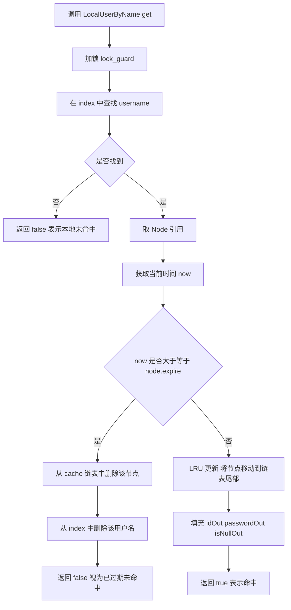

------

### 3. put 写入正常用户数据

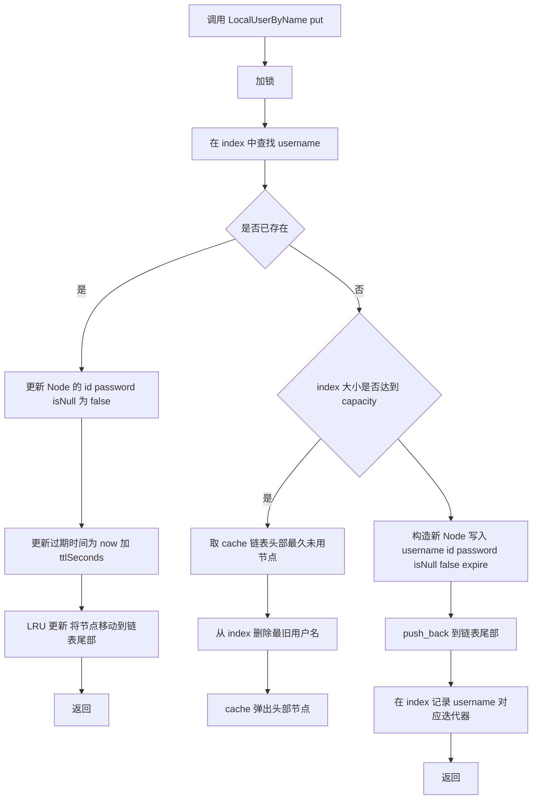

------

### 4. putNull 写入空值缓存

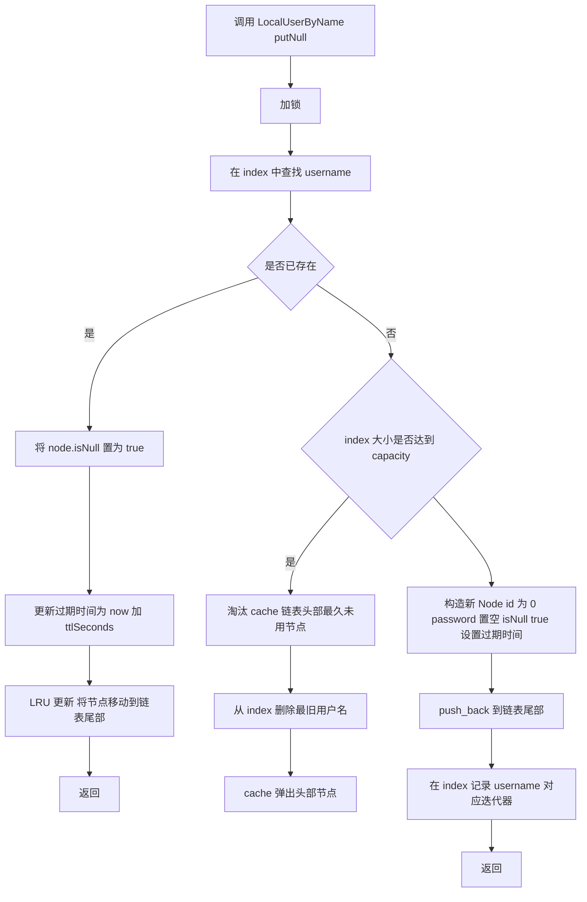

------

### 5. isNull 判断是否被缓存为空值

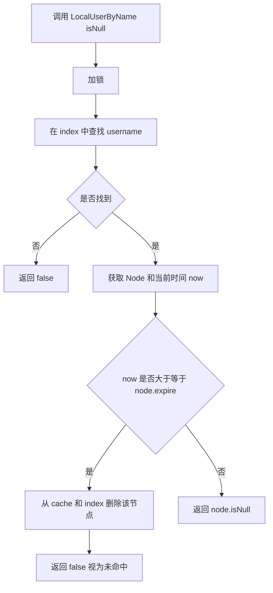

------

## 四、LocalUserCacheByPhone 本地手机号缓存

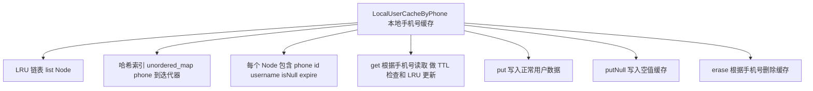

------

## 五、SimpleQpsLimiter 限流器

### allow 调用流程

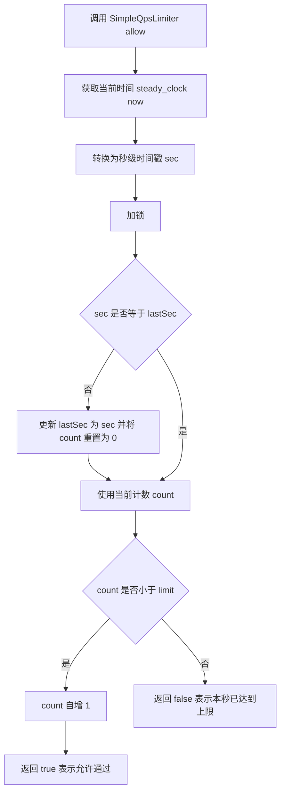

------

## 六、全局实例关系图

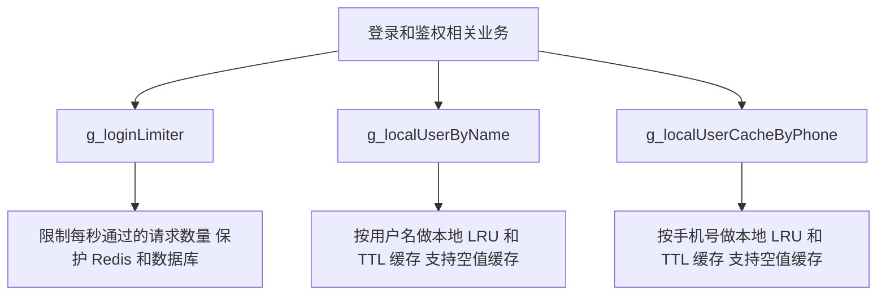

