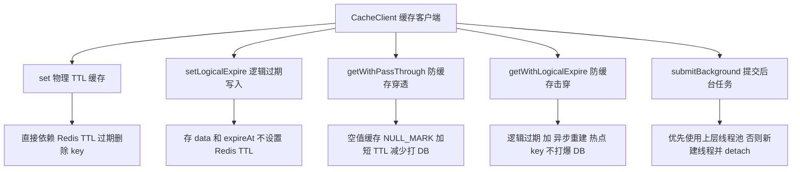
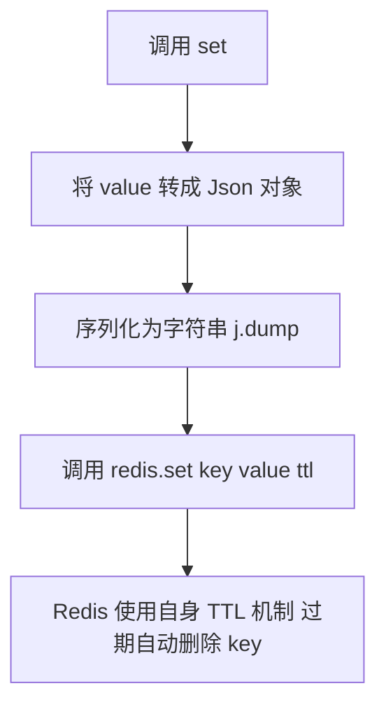
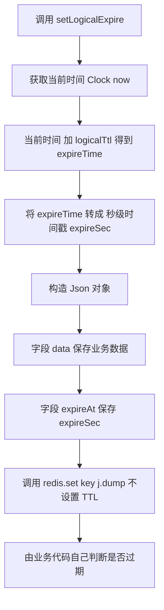
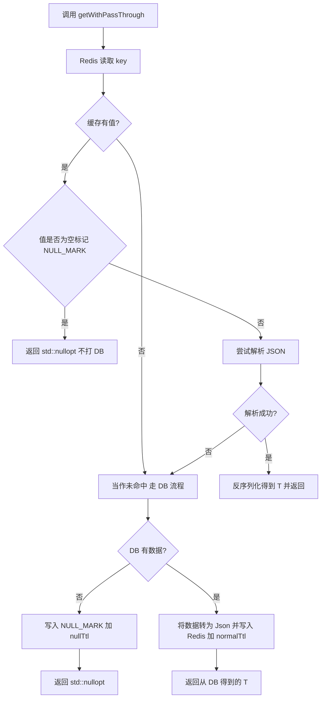
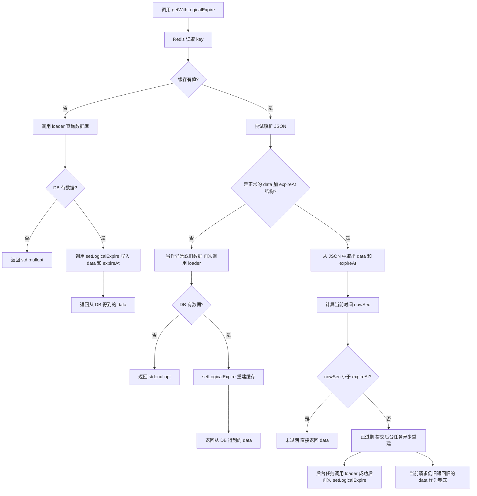
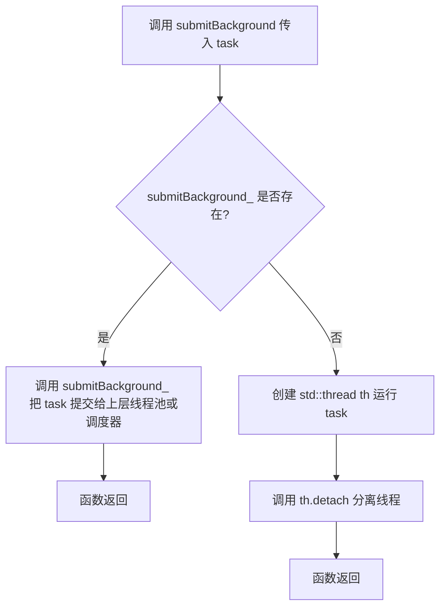

# cache_client.h整体结构总览图

- `set`
- `setLogicalExpire`
- `getWithPassThrough`
- `getWithLogicalExpire`
- `submitBackground`

我都用 **中英+简单中文**，不写那种带括号和逗号的一长串函数签名，尽量兼容你 2024 的 Typora。

------

## 1.整体结构总览图：CacheClient 做了啥

------

## 2. `set`：物理 TTL 写入流程

------

## 3.`setLogicalExpire`：逻辑过期写入流程

------

## 4. `getWithPassThrough`：防缓存穿透流程图

------

## 5.`getWithLogicalExpire`：防缓存击穿（逻辑过期 + 异步重建）

这个我帮你 **保留主要逻辑**，异常和兼容旧格式（直接存 T）统一归在一个“处理异常或旧数据”的节点里，图不会太乱，文字可以在报告里展开。

## 6. `submitBackground`：后台任务提交逻辑

------

