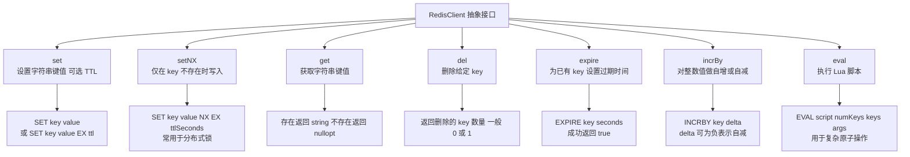
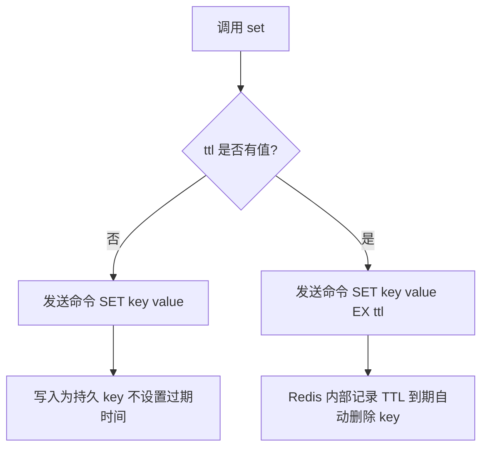
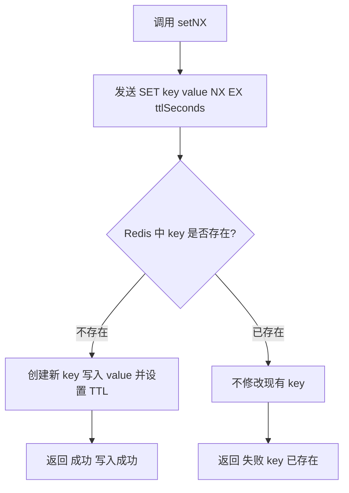
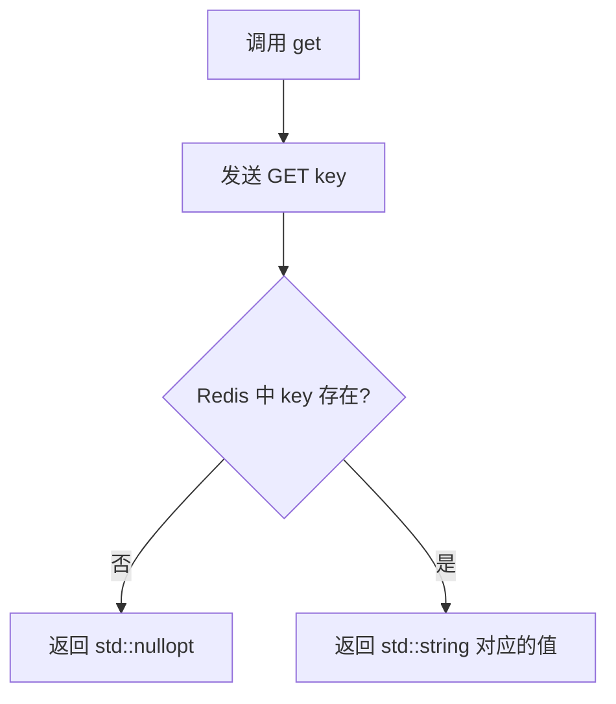
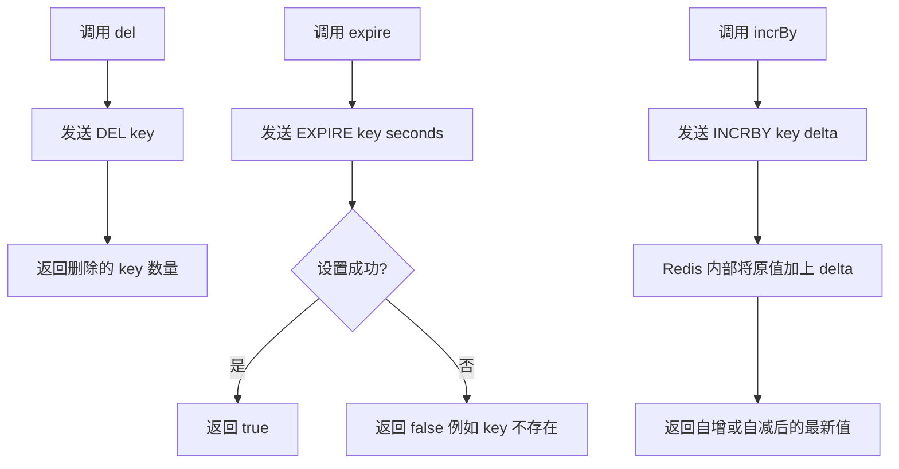
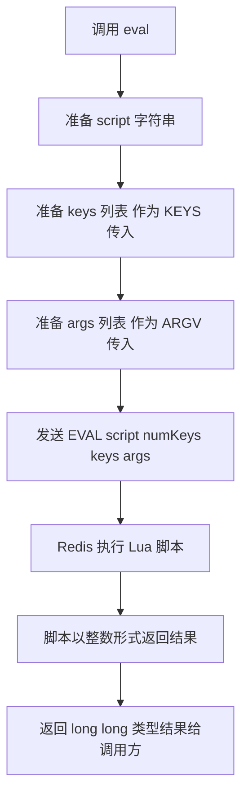

# redis_client.h整体流程图

## 1. RedisClient 接口功能总览图

> 如果 ` ` 在你 Typora 里解析不爽，可以直接改成纯中文，比如 `set\n设置字符串键值可选TTL`，或者干脆删掉 ` `。

------

## 2. `set` 调用流程（带可选 TTL）

------

## 3. `setNX` 调用流程（常用于分布式锁）

> 实际代码里你返回值是 `void`，具体成功失败要看实现怎么设计（比如抛异常、或另外提供返回 bool 的变体）。图里是“逻辑语义”。

------

## 4. `get` 调用流程

------

## 5. `del` + `expire` + `incrBy` 简单图（可以合在一块放）

------

## 6.eval`（Lua 脚本）调用流程

